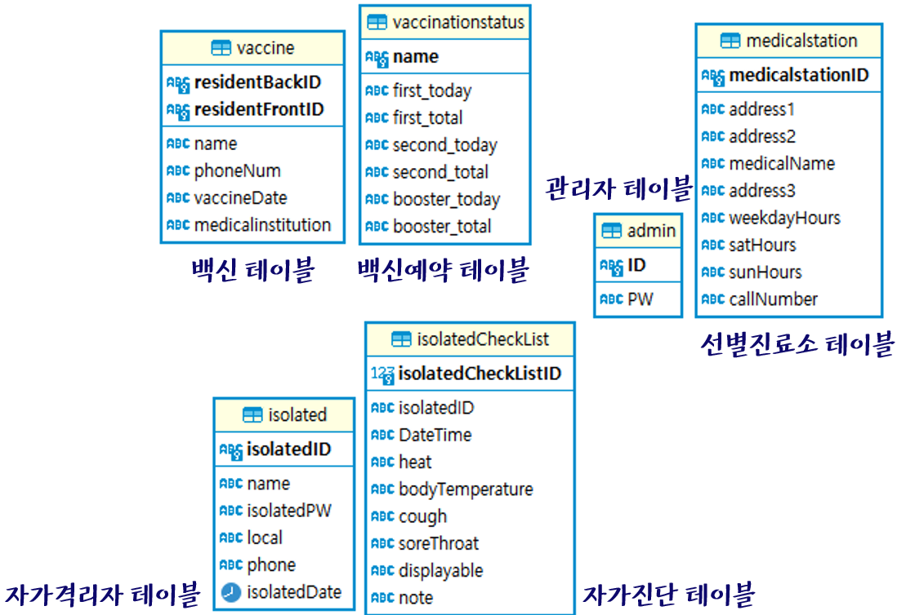

## TCP/IP소캣 통신을 이용한 코로나 종합 시스템_코로나로 inha여_

 
 

## 📑 프로젝트 개요
- 코로나19 바이러스의 대유행으로 인한 질병관리청 종합관리시스템 필요
- 실시간 확진자 현황, 지역별 백신 접종 현황, 자가격리자 단체 채팅, 자가진단, 비인가 패킷 분석 등을  종합관리시스템으로 구현
 

- 접근성 : 코로나19 관련 정보를 쉽게 접근하고 관리
- 구분성 : 이용자와 관리자로 나눠 각자의 역할을 수행
- 보안성 : 서버에 비정상적으로 접근하는 패킷 분석
- 신뢰성 : 실제 사례 데이터를 제공하여 신뢰도 상승

 

## 📋 시스템구성 및 기능
### [ 시스템 구조 ]  

### [ 데이터베이스 구조 ]  

 

## 💻 프로젝트 구현
### [ 인트로 ]

### [ 이용자 ]

### [ 백신 접종 현황 ]

### [ 백신 예약 ]

### [ 선별 진료소 ]

### [ 자가격리자 ]

### [ 자가격리자 - 주요 공지 ]

### [ 자가격리자 - 채팅 ]

### [ 자가격리자 - 자가진단 ]

### [ 관리자 ]

### [ 백신접종현황 ]

### [ 백신예약 ]

### [ 선별진료소 ]

### [ 자가격리자 ]

### [ 자가진단 ]

### [ 비인가 분석 확인 ]

